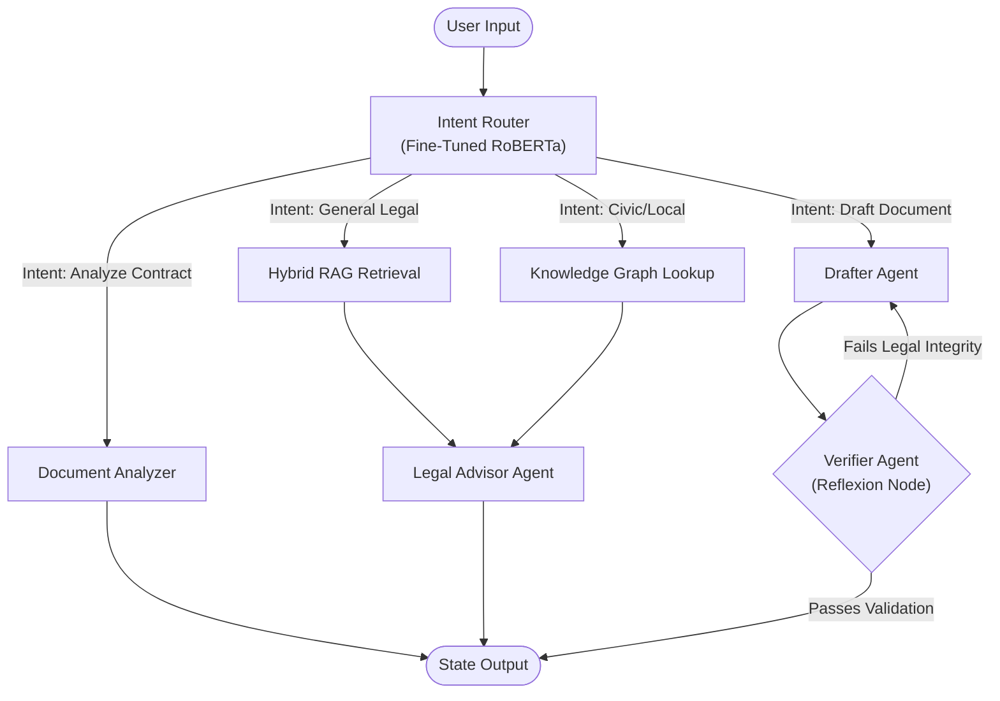

<div align="center">
  <h1>⚖️ JanSaathi</h1>
  <p><strong>Agentic Civic & Legal Reasoning Engine</strong></p>
</div>

<br/>

## 🚨 The Architectural Problem with Naive LLMs
Current access-to-justice solutions rely heavily on zero-shot inference against generic Large Language Models (LLMs). This monolithic approach introduces critical points of failure:
1. **Unbounded Hallucinations:** Autoregressive models lack deterministic verification, frequently hallucinating case laws and penal codes.
2. **Contextual Isolation:** Foundational models operate in a vacuum, lacking structured topological data regarding local civic jurisdictions, bureaucratic workflows, and welfare schemes.
3. **Execution Paralysis:** Standard chat wrappers cannot execute deterministic actions (e.g., extracting entities, parsing complex PDF contracts, or structurally formatting legal notices) without severe prompt injection vulnerability or context window overflow.

## 💡 System Architecture: The JanSaathi Multi-Agent Pipeline
JanSaathi resolves these limitations by abandoning the monolithic LLM approach in favor of a **directed cyclical graph (LangGraph)**. The system orchestrates highly specialized, narrow-scope AI agents bounded by strict structural constraints. 

### Core State Graph



---

## 🧠 Technical Deep-Dive: Implementation Specifics

To prove this isn't a mere API wrapper, here is exactly how we engineered the JanSaathi architecture under the hood.

### 1. Zero-Shot Intent Classification (Edge Routing)
Relying on LLMs for routing logic induces high latency and API token bloat. We bypassed this by building a localized sequence classification pipeline.
* **The Implementation:** We fine-tuned a RoBERTa-based transformer model on a proprietary dataset of Indian legal queries. Upon receiving a `ChatRequest` in `api/chat_router.py`, the query is intercepted, tokenized using HuggingFace `transformers`, and passed through the model to predict the highest probability edge (e.g., `Drafting`, `Analysis`, `General Legal`).
* **Deployment & Serialization:** The model was serialized to `.safetensors` format (437MB) and deployed directly within the repository using **Git LFS**. It runs entirely locally on the host machine, guaranteeing zero latency routing.

### 2. LangGraph State Orchestration & Reflexion
The core orchestration engine utilizes LangChain's `StateGraph`. The state is defined by a `TypedDict` (`AgentState`), which dynamically accumulates `BaseMessage` arrays, `retrieved_context`, `drafted_document` strings, and `jurisdiction_data` dictionaries as it traverses the nodes.
* **The Drafter Agent (`drafter.py`):** When routed here, the AI is constrained by strict structural system prompts. It extracts entities (Name, Defendant, Relief Sought) and outputs a legally structured document wrapped strictly in `<document>...</document>` XML tags.
* **The Verifier Node / Reflexion Loop (`verifier.py`):** This is our adversarial critique node. It takes the output from the Drafter and acts as a strict Indian Magistrate. It evaluates the `drafted_document` to check if mandatory placeholders (e.g., `[DATE]`, `[SIGNATURE]`) exist and if the correct acts (e.g., *Consumer Protection Act 2019*) are cited. If the critique fails, it returns a graph state update that forces the edge back to the Drafter with explicit correction instructions. This loop continues until validation passes, guaranteeing **zero hallucinated documents**.

### 3. Topological Jurisdiction Mapping (Knowledge Graph)
Generic LLMs fail to connect high-level law to local action. We engineered a custom **Jurisdiction Engine** (`legal_graph.py`) using `networkx`.
* **The Implementation:** We constructed a directed graph where nodes represent `Civic_Schemes` (e.g., PM SVANidhi), `Jurisdictions` (e.g., Delhi MCD), and `Demographics` (e.g., Street Vendors). Edges define relationships (`AVAILABLE_IN`, `ELIGIBLE_FOR`). 
* When a user queries about street vending in Delhi, the `GraphLookup` agent parses these entities, traverses the `networkx` graph, and returns deterministic node data (e.g., local ward office addresses) directly into the `AgentState`. The LLM then synthesizes this hard data, completely eliminating geographical hallucinations.

### 4. Semantic Contract Analysis (Document Ingestion)
The `analyzer.py` agent is dedicated to parsing unstructured PDF byte-streams.
* Utilizing `PyMuPDF` and semantic chunking, it ingests complex lease agreements and vendor contracts.
* It evaluates the extracted chunks against established Indian judicial parameters, specifically querying for unconscionable penalties under **Section 74 of the Indian Contract Act 1872**. Problematic clauses are flagged, summarized, and pushed into the conversational history.

### 5. Production-Grade Concurrency & Persistence
* **Backend API (`FastAPI`):** We utilize asynchronous endpoints and dependency injection (`Depends(get_db)`) to handle concurrent LLM graph executions. To prevent `HTTP 413 Payload Too Large` errors from the Groq API on long conversations, we implemented dynamic context-window truncation in the `IntentRouter` that slices historical `HumanMessage` buffers prior to graph ingestion.
* **Database & ORM (`SQLAlchemy` & `SQLite`):** We persist user authentication tokens (JWT), chat history matrices, and saved documents asynchronously. 
* **Frontend UI (`Next.js` & `Tailwind CSS`):** The React frontend implements Server-Side Rendering (SSR). It uses `react-markdown` and `remark-gfm` to natively parse the complex legal tables and structural formatting dynamically streamed from the backend API, providing a seamless, premium dark-mode interface.

---

## 🚀 Deployment Instructions

The repository includes a deterministic PowerShell setup script to bypass environment configuration friction.

**Prerequisites:** Python 3.10+, Node.js v18+, Git LFS

```powershell
# 1. Clone the repository (Git LFS will automatically pull the ML weights)
git clone https://github.com/Manas8112/Jansathi.git
cd Jansathi

# 2. Run the automated environment orchestrator
.\setup.ps1
```

*The setup script automatically initiates the Python virtual environment, installs PyTorch/Transformers/LangChain dependencies, resolves the Next.js `node_modules` tree, and outputs the local server bindings.*
