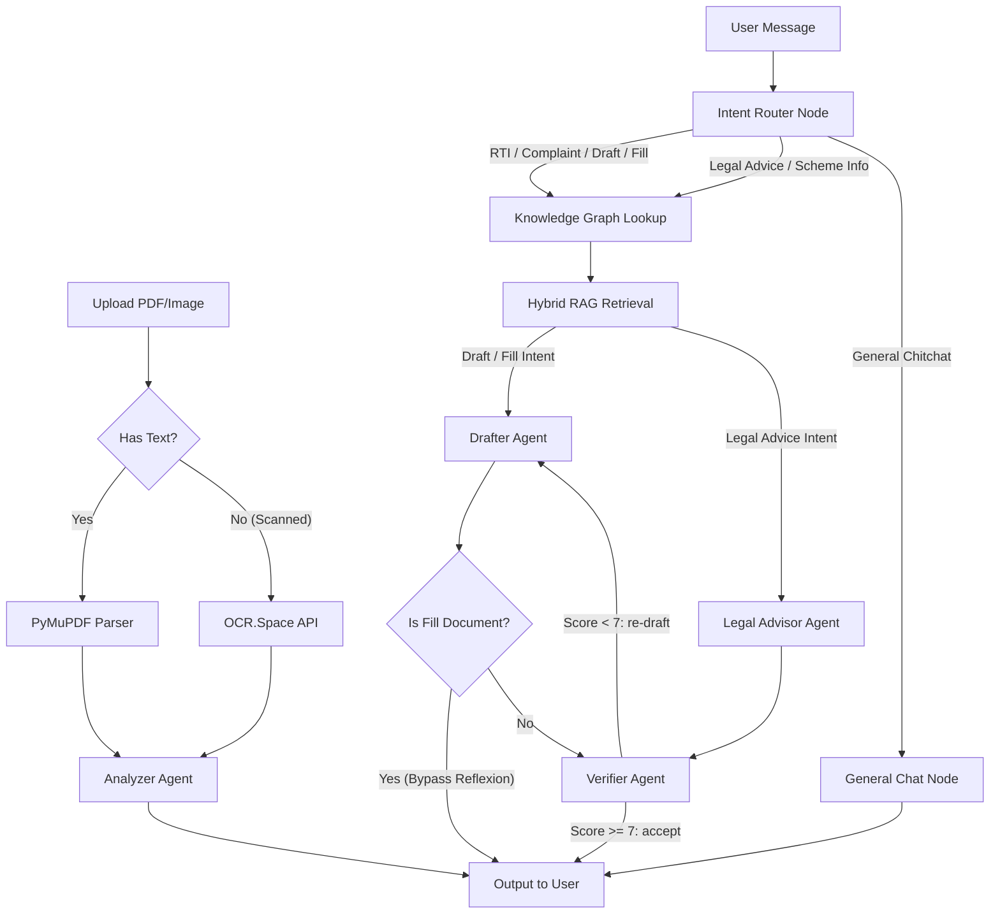

<div align="center">
  <h1>JanSaathi</h1>
  <p><strong>Agentic AI Legal & Civic Reasoning Engine for Indian Citizens</strong></p>
  <p>Built with LangGraph, Hybrid RAG, NetworkX Knowledge Graphs, and a Custom-Trained Intent Classifier</p>
</div>

> **Quick Links:**
> [Setup & Run](#running-locally) · [Architecture Diagram](#state-graph-langgraph-pipeline) · [Technical Deep-Dive](#technical-deep-dive) · [Repo Structure](#repository-structure)

---

## Problem Statement

Over 80% of India's population cannot afford legal representation. Existing AI chatbots (ChatGPT, Claude, etc.) fail catastrophically in the legal domain because:

1. They hallucinate non-existent Indian Penal Code sections and fake case precedents.
2. They have zero awareness of India's jurisdiction hierarchy (which forum to file in depends on claim amount, state, and case type — a generic LLM has no mechanism to compute this).
3. They cannot perform multi-step agentic workflows: analyze a PDF contract, flag illegal clauses, draft a formal legal notice, self-verify the output, and persist the document — all in one pipeline.

JanSaathi solves all three problems through a modular multi-agent architecture where each agent is a narrow specialist, and deterministic knowledge systems constrain every LLM output.

---

## System Architecture

### State Graph (LangGraph Pipeline)



### How It Works (Step by Step)

1. User sends a message via the Next.js frontend.
2. The FastAPI backend receives it in `api/chat_router.py`, loads the conversation history from SQLite, and constructs an `AgentState` TypedDict.
3. The `AgentState` enters the LangGraph `StateGraph` (defined in `agents/graph.py`), which is compiled with `workflow.compile()`.
4. The graph routes through specialized nodes depending on intent, accumulating `retrieved_context`, `jurisdiction_data`, `drafted_document`, and `confidence_score` fields in the state.
5. The final AI message is extracted, `<think>` tags are stripped (for reasoning models like Qwen), `<document>` tags are parsed and saved to the database, and the response is returned to the frontend.

---

## Quick Links 🔗
- [**Frontend Architecture & UI Details**](./frontend/README.md)
- [**Backend & ML Engine Details**](./backend/README.md)
- [**Scalability & Feasibility Report**](./SCALABILITY_FEASIBILITY.md)

---

## Technical Deep-Dive

### 1. Intent Classification (`agents/intent_router.py`)

The first node in the graph classifies the user's message into one of six categories: `RTI`, `Complaint`, `Draft Document`, `Legal Advice`, `Scheme Info`, or `General`.

**How it works:**
- **Local Fine-Tuned Model:** The system natively uses a `law-ai/InLegalBERT` transformer model fine-tuned on a custom dataset of over 6,000 diverse Indian legal intents.
- **Training Data (`intent_training.jsonl`):** We expanded our initial dataset to over 6,000 unique, hand-crafted queries covering RTI applications, consumer complaints, legal notice drafting, and government scheme inquiries.
- **Inference & Fallback:** The local model (`model.safetensors` - 437MB) runs entirely offline with zero latency. If the model is missing or fails, it gracefully falls back to a fast LLM (Groq) using a structured prompt with the last 4 conversation turns.
- Based on the predicted category, the `route_after_intent()` function in `graph.py` selects the next edge (e.g., non-general intents go to the `knowledge_graph` node).

**Why not just use the main LLM for everything?** Routing through a cheap, fast model (temperature=0.0) saves tokens and latency. The expensive model is reserved only for the Drafter and Advisor nodes where quality matters.

---

### 2. Legal Knowledge Graph (`knowledge/legal_graph.py`)

This is a 441-line directed graph built with `networkx.DiGraph()` encoding the structural relationships of Indian law. It contains four layers:

| Layer | Node Type | Examples |
|-------|-----------|----------|
| Layer 1 | Laws | `RTI_ACT_2005`, `CPA_2019`, `RERA_2016`, `IPC_1860`, `CrPC_1973`, `POSH_2013`, `EPF_ACT_1952` |
| Layer 2 | Sections | `RTI_S6` (filing procedure), `RTI_S7` (30-day deadline), `CPA_S35` (District Commission filing), `IPC_S420` (cheating), `IPC_S498A` (domestic violence) |
| Layer 3 | Forums | `DISTRICT_CONSUMER_COMMISSION` (claims up to 50L), `STATE_CONSUMER_COMMISSION` (50L–2Cr), `NATIONAL_CONSUMER_COMMISSION` (above 2Cr), `RERA_AUTHORITY`, `POLICE_FIR` |
| Layer 4 | Remedies | `RTI_REMEDY` (step-by-step filing), `CONSUMER_REMEDY` (legal notice → e-Daakhil → hearing), `CRIMINAL_REMEDY` (evidence → FIR → Section 156(3)) |

**Edges encode relationships:**
- `contains` (RTI_ACT_2005 → RTI_S6)
- `triggers_after_filing` (RTI_S6 → RTI_S7)
- `escalates_to_if_no_response` (RTI_S7 → RTI_S19_FIRST_APPEAL)
- `remedy_via` (IPC_S420 → POLICE_FIR)
- `appeal_to` (DISTRICT_CONSUMER_COMMISSION → STATE_CONSUMER_COMMISSION)

**The key function `get_context_for_intent()`** traverses this graph and returns a formatted string of verified legal facts. This string is injected into the LLM prompt as a `=== VERIFIED LEGAL FACTS (from Knowledge Graph — DO NOT contradict these) ===` block, acting as a hard constraint on what the LLM can output.

**Section-specific lookup:** If the user mentions "Section 420" in their message, the function `get_section_facts()` directly looks up `IPC_S420` in the graph, retrieves its punishment, cognizability, bail status, and connected remedies via `G.out_edges()`, and injects all of this before the LLM even sees the query.

---

### 3. Jurisdiction Engine (`knowledge/jurisdiction_engine.py`)

A purely deterministic rules engine (310 lines, zero LLM involvement) that maps `{case_type, claim_amount, state}` to exact:
- **Forum** (District / State / National Commission)
- **Filing fees** (₹0 for claims under ₹5 lakh, ₹200 for ₹5L–10L, etc.)
- **Limitation periods** (2 years from cause of action for consumer disputes)
- **Portal URLs** (https://edaakhil.nic.in, state-specific RERA portals)
- **Escalation paths** (District → State → National → Supreme Court)
- **Required documents** (invoice, payment proof, legal notice copy, etc.)

**Supported case types:** Consumer disputes (with amount-based forum routing), RTI applications (central vs. state PIO routing), RERA/builder disputes (with state-specific portal mapping for Maharashtra, Karnataka, Delhi, UP, Gujarat, Tamil Nadu, Telangana, Rajasthan), and workplace/labour disputes.

The output is a `JurisdictionResult` dataclass whose `.to_prompt_string()` method formats all fields as `=== JURISDICTION ENGINE OUTPUT (Deterministic — Ground Truth) ===` and injects it into the LLM context alongside the Knowledge Graph output.

**Why this matters:** The LLM can never hallucinate the wrong court, wrong fee, or wrong deadline because the engine provides the answer first, and the prompt instructs the LLM to not contradict verified facts.

---

### 4. Hybrid RAG Pipeline (`rag/pipeline.py`)

A four-stage retrieval pipeline that grounds the LLM in actual legal documents stored in ChromaDB:

**Stage 1 — Query Expansion:** The user query is sent to a fast LLM that generates 3 alternative phrasings using formal Indian legal terminology. All 4 queries (original + expansions) are searched in parallel.

**Stage 2 — Dual Search:**
- **Vector search** via ChromaDB using `BAAI/bge-small-en-v1.5` embeddings (384-dim, cosine similarity via HNSW index).
- **BM25 keyword search** via `rank_bm25.BM25Okapi` initialized over the entire corpus. This catches exact legal term matches that embedding models miss (e.g., "Section 498A" as a keyword).

**Stage 3 — Reciprocal Rank Fusion (RRF):** Vector and BM25 results are merged using RRF with configurable weights (default: 0.6 vector, 0.4 BM25). The formula is `score = weight * (1 / (60 + rank))` per result source. Documents appearing in both lists get boosted scores.

**Stage 4 — Cross-Encoder Reranking:** The merged candidates are passed through `cross-encoder/ms-marco-MiniLM-L-12-v2` (a 33M parameter cross-encoder) which scores each `(query, document)` pair for semantic relevance. The top-N results (default: 3) by rerank score are returned.

---

### 5. Drafter Agent (`agents/drafter.py`)

When the intent is `RTI` or `Complaint`, this agent generates a complete, legally structured document.

**Key implementation details:**
- The system prompt enforces XML output: the drafted document must be wrapped in `<document>...</document>` tags. The `chat_router.py` backend uses `re.search(r'<document>(.*?)</document>', content, flags=re.DOTALL)` to extract the document, save it to the `saved_documents` table, and strip it from the chat reply.
- The prompt requires formal Indian legal language with correct headings (To, Subject, Facts, Prayer/Relief Sought), specific Act/Section citations, and placeholders like `[YOUR FULL NAME]`, `[DATE]`, `[DISTRICT]` where user data is missing.
- Context window management: only the last 6 messages (3 conversation turns) are included in the history to prevent token overflow on the Groq API (2048 max_tokens).
- Jinja2 templates exist for RTI Form A, Consumer Complaints, RERA Complaints, and Legal Notices (`backend/templates/`) for PDF rendering via WeasyPrint.

---

### 6. Verifier Agent — Reflexion Loop (`agents/verifier.py`)

Based on the Reflexion technique (Shinn et al., 2023). After every legal response, this node acts as an adversarial critic.

**How it works:**
1. The Verifier extracts the last `AIMessage` and the last `HumanMessage` from the state.
2. It sends both to a fast LLM with a structured evaluation prompt that checks 6 criteria: actionable roadmap, law section citations, specific forum/authority, deadline/timeframe, non-hedging language, and relevance to the question.
3. The LLM returns a JSON object: `{"passes": true/false, "issues": [...], "score": 0-10}`.
4. If `passes == false` AND `score < 7` AND issues are non-empty, the Verifier triggers a re-draft: it sends the issues list + the original context to a correction LLM, which generates an improved response.
5. The corrected response replaces the original `AIMessage` in the state.
6. **Drafted documents bypass verification** — if `state["drafted_document"]` exists, the Verifier returns immediately, because documents have their own structural constraints and should not be forced into the "Action Roadmap" format.

---

### 7. Contract Analysis (`agents/analyzer.py` + `api/documents.py`)

Users can upload PDF files (lease agreements, employment contracts, vendor agreements) for AI-powered clause analysis.

**Pipeline:**
1. `api/documents.py` receives the `UploadFile`, reads the byte stream, and uses `PyPDF2.PdfReader` to extract text from up to 10 pages.
2. The extracted text (truncated to 15,000 characters) is sent to `analyzer.py`, which evaluates it against Indian judicial parameters:
   - Tenant contracts: 11-month lock-in without exit, non-refundable deposits, arbitrary eviction, landlord right to enter without notice.
   - Employment contracts: Illegal bonds, arbitrary termination, PF withholding, extreme non-competes.
   - Consumer contracts: Unfair penalties, waiver of right to sue, hidden charges.
3. Problematic clauses are flagged with the clause text, why it violates Indian law, and what the user should negotiate.
4. The analysis is saved to the conversation history (both the human context and AI response as `DBMessage` rows).

---

### 8. Pydantic Guardrail Schemas (`guardrails/schemas.py`)

We defined strict Pydantic models to validate structured outputs:
- `LegalResponse`: `summary`, `applicable_laws: list[LawCitation]`, `rights_identified`, `remedies: list[Remedy]`, `action_steps: list[ActionStep]`, `confidence: Literal["high", "medium", "low"]`.
- `RTIApplication`: `addressed_to`, `department`, `subject`, `information_points`, `fee_info`, `legal_reference`.
- `LegalNotice`: `addressed_to`, `facts`, `legal_basis`, `demand`, `deadline_days`.
- `SchemeMatch`: `scheme_name`, `eligibility_status: Literal["eligible", "likely_eligible", "check_locally"]`, `documents_needed`, `where_to_apply`.

---

### 9. Full-Stack Application

**Backend (FastAPI):**
- Async endpoints with dependency injection (`Depends(get_db)`, `Depends(get_current_user)`)
- JWT-based authentication with bcrypt password hashing
- SQLAlchemy async sessions with SQLite
- Database models: `User`, `Conversation`, `Message`, `SavedDocument`
- CRUD APIs: conversations (list, get, delete), documents (save, list, get, delete, analyze)
- `<think>` tag stripping utility for reasoning models (Qwen, DeepSeek) that leak chain-of-thought

**Frontend (Next.js 14 + Tailwind CSS):**
- Dark-mode native UI with pitch-black background
- `react-markdown` + `remark-gfm` + `rehype-raw` for rendering legal tables, bold citations, and structured advice
- PDF upload button with drag-and-drop for contract analysis
- Chat sidebar with conversation history and per-chat delete buttons
- My Documents dashboard with preview and PDF download
- Protected routes with cookie-based auth and automatic redirect

---

### 10. Interactive Document Filling & Vision OCR

We have vastly expanded JanSaathi's capabilities to interact with document generation and upload:

**Interactive Blank Template Filling:**
When the Drafter Agent (`agents/drafter.py`) generates a document with missing placeholders (e.g. `[Your Name]`), it now proactively asks the user if they want those details filled. The Intent Router detects this context, allowing users to simply type their details into the chat, and the AI injects them into the template to produce a ready-to-export final Markdown document.

**Premade Form Handling & OCR Fallback:**
Users can upload blank government forms or contracts to the chat. 
- The `api/documents.py` endpoint uses `PyMuPDF` to extract text and analyze the document.
- **OCR.Space API Fallback:** If the uploaded PDF is image-based or scanned, the backend converts the first page into a PNG and securely sends it to the free **OCR.Space API**. This provides fast, cloud-based OCR without requiring heavy, server-crashing libraries like Tesseract on the deployment host. 
- The Analyzer identifies the missing fields, asks the user for them, and returns a cleanly structured Markdown version of the filled form.

---

## Running Locally

**Prerequisites:** Python 3.10+, Node.js v18+, Git LFS

```bash
# Clone (Git LFS pulls the 437MB intent classifier automatically)
git clone https://github.com/Manas8112/Jansathi.git
cd Jansathi

# Copy the pre-configured environment file (API keys included)
cp backend/.env.example backend/.env

# Automated setup (Windows)
.\setup.ps1

# Start Backend
cd backend
.\.venv\Scripts\activate
uvicorn main:app --reload

# Start Frontend (separate terminal)
cd frontend
npm run dev
```

The app will be live at `http://localhost:3000` (frontend) and `http://localhost:8000` (backend API).

---

## Repository Structure

```
Jansathi/
├── backend/
│   ├── agents/
│   │   ├── graph.py              # LangGraph StateGraph definition & compilation
│   │   ├── state.py              # AgentState TypedDict (messages, intent, context, score)
│   │   ├── intent_router.py      # Intent classification node
│   │   ├── graph_lookup.py       # Knowledge Graph + Jurisdiction Engine injection
│   │   ├── retriever.py          # Hybrid RAG retrieval node
│   │   ├── drafter.py            # Document drafting + legal advice + general chat nodes
│   │   ├── verifier.py           # Reflexion self-correction node
│   │   └── analyzer.py           # PDF contract analysis agent
│   ├── knowledge/
│   │   ├── legal_graph.py        # NetworkX DiGraph (441 lines, 4-layer legal ontology)
│   │   └── jurisdiction_engine.py # Deterministic rules engine (310 lines, 0 LLM)
│   ├── rag/
│   │   ├── chroma_store.py       # ChromaDB + BGE embeddings
│   │   └── pipeline.py           # 4-stage hybrid RAG (expand → search → RRF → rerank)
│   ├── guardrails/
│   │   └── schemas.py            # Pydantic models for structured legal outputs
│   ├── templates/                # Jinja2 templates for RTI, Legal Notice, Consumer, RERA
│   ├── utils/
│   │   ├── llm_utils.py          # <think> tag stripping for reasoning models
│   │   └── template_renderer.py  # Jinja2 → HTML → PDF (WeasyPrint)
│   ├── auth/                     # JWT auth, bcrypt, SQLAlchemy models
│   ├── api/
│   │   ├── chat_router.py        # /api/chat/ endpoints (send, list, delete conversations)
│   │   └── documents.py          # /api/documents/ endpoints (CRUD + PDF analysis)
│   └── models/
│       └── intent_classifier/    # Fine-tuned transformer weights (Git LFS)
├── frontend/
│   └── src/app/
│       ├── login/page.tsx        # Auth UI (login + register)
│       ├── chat/page.tsx         # Main chat interface with sidebar
│       └── dashboard/page.tsx    # My Documents dashboard with PDF export
└── setup.ps1                     # One-command automated setup script
```
