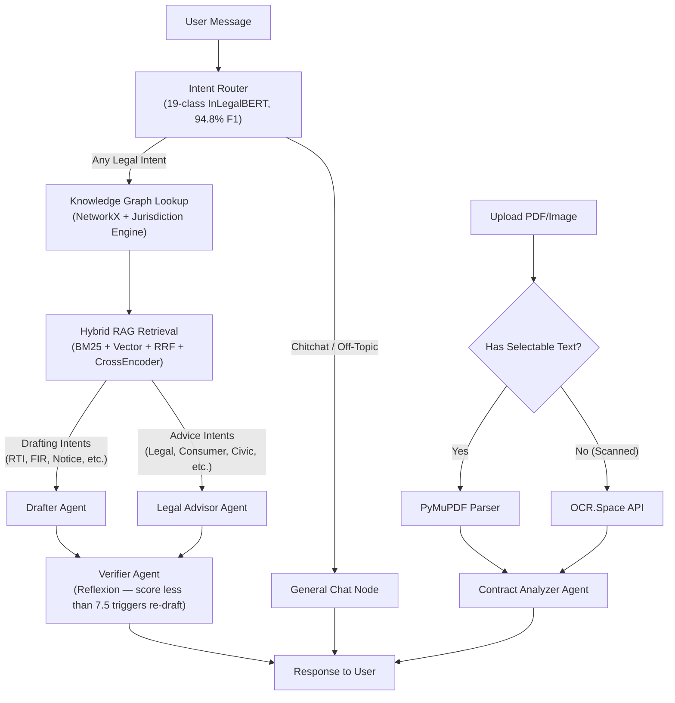

<div align="center">
  <h1>JanSaathi 🇮🇳</h1>
  <p><strong>Agentic AI Legal & Civic Reasoning Engine for Indian Citizens</strong></p>
  <p>Built with LangGraph · Hybrid RAG · NetworkX Knowledge Graphs · Custom 19-Class InLegalBERT Classifier · Reflexion Self-Correction</p>
</div>

> **Quick Links:**
> [Setup & Run](#running-locally) · [Architecture](#state-graph-langgraph-pipeline) · [Technical Deep-Dive](#technical-deep-dive) · [Repo Structure](#repository-structure)

---

## Problem Statement

Over 80% of India's population cannot afford legal representation. Existing AI chatbots (ChatGPT, Claude, etc.) fail catastrophically in the legal domain because:

1. They hallucinate non-existent Indian Penal Code sections and fake case precedents.
2. They have zero awareness of India's jurisdiction hierarchy (which forum to file in depends on claim amount, state, and case type — a generic LLM has no mechanism to compute this).
3. They cannot perform multi-step agentic workflows: classify intent, retrieve verified law, draft a formal document, self-verify the output, and persist it — all in one pipeline.

JanSaathi solves all three through a modular multi-agent architecture where every agent is a narrow specialist, and deterministic knowledge systems constrain every LLM output.

---

## System Architecture

### State Graph (LangGraph Pipeline)



### Intent Classes (19 Total)

| Pipeline | Intent Classes |
|----------|---------------|
| **Draft Document** | `RTI_Central`, `RTI_State`, `RTI_FirstAppeal`, `Police_FIR`, `Legal_Notice`, `Employment_Agreement`, `Contract_Review`, `Fill_Document` |
| **Legal Advice** | `General_Legal_Advice`, `Consumer_District`, `Consumer_RERA`, `Domestic_Violence`, `Cybercrime`, `Tenant_Landlord`, `Cheque_Bounce`, `Labour_Dispute`, `Scheme_Info`, `Civic_Info` |
| **General Chat** | `Chitchat` |

---

## Quick Links 🔗
- [**Frontend Architecture & UI Details**](./frontend/README.md)
- [**Backend & ML Engine Details**](./backend/README.md)
- [**Scalability & Feasibility Report**](./SCALABILITY_FEASIBILITY.md)

---

## Technical Deep-Dive

### 1. Intent Classification (`agents/intent_router.py`)

The first node in the graph classifies the user's message into one of **19 specialized categories**.

**How it works:**
- **Local Fine-Tuned Model:** A `law-ai/InLegalBERT` transformer model fine-tuned on a custom dataset of over **6,000+ diverse Indian legal intent examples** using the HuggingFace `Trainer` API (3 epochs, batch size 8, learning rate 2e-5).
- **Model Performance:** Achieved a **Macro F1 Score of 94.8%** on the validation set. Per-epoch scores: Epoch 1 → 92.7%, Epoch 2 → 93.5%, Epoch 3 → **94.8%**.
- **Training Data:** Two datasets merged: `intent_training.jsonl` (original 6-class, remapped) + `intent_training_v2.jsonl` (4,650 new examples across all 19 classes).
- **Inference:** Runs fully offline. If confidence < 80%, gracefully falls back to a Groq LLM call with a structured prompt listing all 19 categories.
- **Pre-checks:** Before the model runs, chitchat patterns and blocked keywords (fictional characters, recipes, off-topic) are detected by string matching for instant routing with zero latency.

---

### 2. Legal Knowledge Graph (`knowledge/legal_graph.py`)

A 441-line directed graph built with `networkx.DiGraph()` encoding the structural relationships of Indian law. It contains four layers:

| Layer | Node Type | Examples |
|-------|-----------|----------|
| Layer 1 | Laws | `RTI_ACT_2005`, `CPA_2019`, `RERA_2016`, `IPC_1860`, `CrPC_1973`, `POSH_2013`, `EPF_ACT_1952` |
| Layer 2 | Sections | `RTI_S6` (filing procedure), `RTI_S7` (30-day deadline), `CPA_S35` (District Commission), `IPC_S420` (cheating), `IPC_S498A` (domestic violence) |
| Layer 3 | Forums | `DISTRICT_CONSUMER_COMMISSION` (<₹50L), `STATE_CONSUMER_COMMISSION` (₹50L–₹2Cr), `NATIONAL_CONSUMER_COMMISSION` (>₹2Cr), `RERA_AUTHORITY`, `POLICE_FIR` |
| Layer 4 | Remedies | `RTI_REMEDY`, `CONSUMER_REMEDY`, `CRIMINAL_REMEDY` |

**Edges encode legal relationships:** `contains`, `triggers_after_filing`, `escalates_to_if_no_response`, `remedy_via`, `appeal_to`.

The key function `get_context_for_intent()` traverses this graph and injects verified facts as a `=== VERIFIED LEGAL FACTS (DO NOT contradict) ===` block into the LLM prompt — acting as a hard constraint against hallucination.

---

### 3. Jurisdiction Engine (`knowledge/jurisdiction_engine.py`)

A purely **deterministic rules engine** (310 lines, **zero LLM involvement**) that maps `{case_type, claim_amount, state}` to exact:
- **Forum** (District / State / National Commission)
- **Filing fees** (₹0 for claims <₹5 lakh, ₹200 for ₹5L–₹10L, etc.)
- **Limitation periods** (2 years from cause of action for consumer disputes)
- **Portal URLs** (https://edaakhil.nic.in, state-specific RERA portals)
- **Escalation paths** and **Required documents**

Supported case types: Consumer disputes (amount-based forum routing), RTI (central vs. state PIO routing), RERA/builder disputes (state-specific portal mapping for 9 states), workplace/labour disputes.

Output is injected as `=== JURISDICTION ENGINE OUTPUT (Deterministic — Ground Truth) ===` alongside Knowledge Graph context. The LLM is instructed never to contradict these verified facts.

---

### 4. Hybrid RAG Pipeline (`rag/pipeline.py`)

A four-stage retrieval pipeline:

**Stage 1 — Query Expansion:** Fast LLM generates 3 alternate phrasings using formal Indian legal terminology. All 4 queries searched in parallel.

**Stage 2 — Dual Search:**
- **Vector search** via ChromaDB using `BAAI/bge-small-en-v1.5` embeddings (384-dim, cosine similarity via HNSW index).
- **BM25 keyword search** via `rank_bm25.BM25Okapi` over the full corpus. Catches exact legal term matches that embeddings miss (e.g., "Section 498A").

**Stage 3 — Reciprocal Rank Fusion (RRF):** Vector and BM25 results merged with configurable weights (0.6 vector, 0.4 BM25). Formula: `score = weight * (1 / (60 + rank))`.

**Stage 4 — Cross-Encoder Reranking:** Merged candidates re-scored by `cross-encoder/ms-marco-MiniLM-L-12-v2` (33M params). Top-3 results by semantic relevance returned.

---

### 5. Drafter Agent (`agents/drafter.py`)

Three specialized nodes:

**`draft_document_node()`** — For drafting intents (RTI, FIR, Legal Notice, etc.):
- Enforces XML output: document inside `<document>...</document>` tags. The backend uses regex to extract, save to `saved_documents` table, and strip from the chat reply.
- Requires formal Indian legal headings with `[YOUR FULL NAME]`, `[DATE]`, `[DISTRICT]` placeholders where user data is missing.
- Auto-detects language and forces the LLM to reply in the same language (Hindi/Hinglish/English).

**`legal_advice_node()`** — For advice intents:
- Generates structured advice with ⚖️ Your Legal Rights, 🗺️ Action Roadmap, 📞 Key Contacts sections.
- Falls back to conversational reply for specific follow-up questions.

**`general_chat_node()`** — For chitchat and civic info queries.

---

### 6. Verifier Agent — Reflexion Loop (`agents/verifier.py`)

Based on the **Reflexion technique** (Shinn et al., 2023). After every legal response, this node acts as an adversarial critic.

**8 evaluation criteria:** actionable roadmap, law section citations, specific forum/authority, deadline/timeframe, non-hedging language, relevance, no hallucinated law sections, no contradictions with conversation history.

**Scoring:** Fast LLM returns `{"passes": bool, "issues": [...], "score": 0-10}`. If `score < 7.5`, a larger correction LLM re-drafts with the issues list as explicit feedback. Drafted documents and guardrail refusals bypass verification automatically.

---

### 7. Language Awareness (`utils/language_utils.py`)

- `detect_language()` — detects Hindi (Devanagari Unicode block >10%), Hinglish (keyword matching, threshold ≥ 2 words), or English.
- `get_language_instruction()` — returns a `LANGUAGE RULE` string injected into every LLM system prompt, forcing reply language to match user's input.
- Graph Lookup node translates Hindi/Hinglish to English before querying the vector database to ensure retrieval quality.

---

### 8. Contract Analysis (`agents/analyzer.py` + `api/documents.py`)

**Pipeline:**
1. `api/documents.py` receives `UploadFile`, uses `PyPDF2.PdfReader` to extract text from up to 10 pages.
2. **OCR.Space API fallback** — If PDF is scanned/image-based, converts first page to PNG and calls OCR.Space API. No heavy Tesseract dependency needed on the server.
3. `analyzer.py` evaluates against Indian judicial parameters: tenant contracts (11-month lock-in, non-refundable deposits, arbitrary eviction), employment contracts (illegal bonds, PF withholding, extreme non-competes), consumer contracts (unfair penalties, waiver of right to sue).
4. Problematic clauses flagged with the clause text, why it violates Indian law, and what to negotiate.

---

### 9. Full-Stack Application

**Backend (FastAPI):**
- Async endpoints with dependency injection (`Depends(get_db)`, `Depends(get_current_user)`)
- JWT-based authentication with bcrypt password hashing
- SQLAlchemy async sessions with SQLite
- Database models: `User`, `Conversation`, `Message`, `SavedDocument`
- `<think>` tag stripping utility for reasoning models (Qwen, DeepSeek)

**Frontend (Next.js 14 + Tailwind CSS):**
- Dark-mode native UI with pitch-black background
- `react-markdown` + `remark-gfm` + `rehype-raw` for rendering legal tables, bold citations, structured advice
- PDF upload button with drag-and-drop for contract analysis
- Chat sidebar with conversation history and per-chat delete buttons
- My Documents dashboard with preview and PDF download
- Protected routes with cookie-based auth and automatic redirect

---

## Key Differentiators vs Generic AI Chatbots

| Feature | ChatGPT / Claude | JanSaathi |
|---------|-----------------|-----------|
| Hallucinated law sections | ❌ Common | ✅ Blocked by Knowledge Graph hard constraints |
| Wrong court / jurisdiction | ❌ Common | ✅ Deterministic rules engine computes exact forum |
| Reply in user's language | ❌ Ignores | ✅ Auto-detects Hindi/Hinglish/English, replies to match |
| Self-correction | ❌ None | ✅ Reflexion loop scores every response, re-drafts if <7.5/10 |
| Domain restriction | ❌ Answers anything | ✅ Hard guardrail blocks off-topic, fiction, recipes |
| Intent specialization | ❌ Generic | ✅ 19 specialized classes, 94.8% accuracy |
| Document persistence | ❌ None | ✅ Drafted docs saved to DB, downloadable as PDF |
| Scanned PDF support | ❌ None | ✅ OCR.Space API fallback for image-based forms |

---

## Running Locally

**Prerequisites:** Python 3.10+, Node.js v18+

```bash
# Clone the repository
git clone https://github.com/Manas8112/Jansathi.git
cd Jansathi

# Copy the pre-configured environment file
cp backend/.env.example backend/.env

# Automated setup (Windows PowerShell)
.\setup.ps1

# Start Backend (in one terminal)
cd backend
.\.venv\Scripts\activate
uvicorn main:app --reload

# Start Frontend (in a second terminal)
cd frontend
npm run dev
```

App runs at `http://localhost:3000` (frontend) and `http://localhost:8000/docs` (backend API).

---

## Repository Structure

```
Jansathi/
├── backend/
│   ├── agents/
│   │   ├── graph.py              # LangGraph StateGraph — all nodes, edges, conditional routing
│   │   ├── state.py              # AgentState TypedDict (messages, intent, context, score, etc.)
│   │   ├── intent_router.py      # 19-class intent classification (local model + Groq fallback)
│   │   ├── graph_lookup.py       # Knowledge Graph + Jurisdiction Engine injection node
│   │   ├── retriever.py          # Hybrid RAG retrieval node
│   │   ├── drafter.py            # Draft, Advice, and General Chat nodes
│   │   ├── verifier.py           # Reflexion self-correction node (8-criteria critic)
│   │   └── analyzer.py           # PDF contract analysis agent
│   ├── knowledge/
│   │   ├── legal_graph.py        # NetworkX DiGraph (441 lines, 4-layer legal ontology)
│   │   └── jurisdiction_engine.py # Deterministic rules engine (310 lines, 0 LLM calls)
│   ├── rag/
│   │   ├── chroma_store.py       # ChromaDB + BGE embeddings
│   │   └── pipeline.py           # 4-stage hybrid RAG (expand → BM25+vector → RRF → rerank)
│   ├── guardrails/
│   │   └── schemas.py            # Pydantic models for structured legal outputs
│   ├── templates/                # Jinja2 templates for RTI, Legal Notice, Consumer, RERA PDFs
│   ├── utils/
│   │   ├── llm_utils.py          # think-tag stripping for reasoning models
│   │   ├── language_utils.py     # Hindi/Hinglish/English detection + LLM instruction injection
│   │   ├── placeholder_utils.py  # Extracts [PLACEHOLDER] fields from drafted documents
│   │   └── template_renderer.py  # Jinja2 to HTML to PDF (WeasyPrint)
│   ├── auth/                     # JWT auth, bcrypt, SQLAlchemy models
│   ├── api/
│   │   ├── chat_router.py        # /api/chat/ endpoints (send, list, delete conversations)
│   │   └── documents.py          # /api/documents/ endpoints (CRUD + PDF analysis + OCR)
│   ├── training/
│   │   ├── retrain_classifier_v2.py  # Fine-tuning script (3 epochs, 94.8% F1, 19 classes)
│   │   └── ingest_knowledge_base.py  # ChromaDB ingestion script
│   ├── data/
│   │   └── datasets/
│   │       ├── intent_training.jsonl    # Original 6-class dataset (~1,500 examples)
│   │       └── intent_training_v2.jsonl # 19-class dataset (4,650 examples)
│   └── models/
│       └── intent_classifier/    # Fine-tuned InLegalBERT (438MB, 94.8% F1, 19 classes)
├── frontend/
│   └── src/app/
│       ├── login/page.tsx        # Auth UI (login + register)
│       ├── chat/page.tsx         # Main chat interface with sidebar
│       └── dashboard/page.tsx    # My Documents dashboard with PDF export
├── setup.ps1                     # One-command automated setup script
└── README.md                     # This file
```

